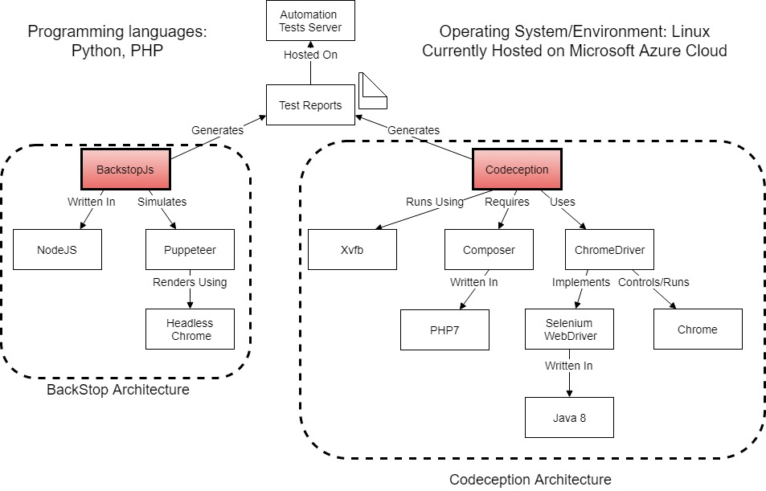

# Automation Tests AutoBots

The purpose of this project is to automate integration and acceptance testing on a website.  This project contains acceptance test suites, visual pixel comparison testing, and scripts to help generate the tests. This project uses Selenium/Codception/Chromedriver as the headless browser server and testing framework, and BackstopJs/Puppeteer.

The purpose of this project is an automated cotinuous intergration continuous deployment system that also automatically run acceptance testing on the project and build every time new code is committed by a developer. It can also be set to test the overall health and functionality of the website every interval of time.  If anything were to break or cease to function on the main website, then the automated build tool will pick up the error and immediately notify the developer before letting the new commit become prod.

## Getting Started

This Project will be optimized for running Jenkins automation server on an Ubuntu 16.04 LTS Virtual Machine on Microsoft Azure Cloud. The languages that you may want to be familiar with are Python 3, Java 8, JavaScript(NodeJS), and Php 5.

Without the building aspect of the project, there is a option to have the project run as a cron job. Only the testing portion of the project will run. The cron job will run the tests periodically.




## Step-by-Step Set Up of Environment

The Biggest and most important components of this project are Codeception, and BackstopJS. Most other pre-requisite and dependencies are there to run those things. lets try to avoid dependency hell.
Get Azure Ubuntu 16.04 server
On the server,

### For Codeception & Dependencies

Install PHP

```bash
sudo apt install php-pear php-fpm php-dev php-zip php-curl php-gd php-mysql php-xmlrpc php-mbstring php-xml libapache2-mod-php
```

Installing Composer

```bash
sudo apt install composer
```


cd to your desired project directory then

Installing Codeception
```bash
composer require codeception/codeception --dev
```
Then run codeception using
```bash
php vendor/bin/codecept
```
Boostrap the testing environment using
```bash
php vendor/bin/codecept bootstrap
```
Now to make codecept a global command use the following then refresh .bashrc
```bash
export PATH=/home/bliu/codecept/vendor/bin:$PATH
source ~/.bashrc
```
At this point in time if you were to cd to the test suite directory and type
```bash
codecept run --steps --html
```
Codeception will technically run but since we do not have chromedriver or selenium set up, it will just return errors

### For Selenium Server

The Selenium server automates browsers. The server is needed to run Webdriver/Chromedriver. For more info go to [Selenium HQ](www.selemiumhq.org)
Selenium server artifact is written in Java and requires Java 8 JDK or JRE

To Install Java 8 Enter the following commands
```
sudo add-apt-repository ppa:webupd8team/java
sudo apt update
sudo apt install oracle-java8-installer
```
Note you may need to click Ok and accept a few license agreements from Oracle

To Install Selenium Server
```
wget -N http://selenium-release.storage.googleapis.com/3.13/selenium-server-standalone-3.13.0.jar -P ~/
sudo mv -f ~/selenium-server-standalone-3.13.0.jar /usr/local/bin/selenium-server-standalone.jar
sudo chown root:root /usr/local/bin/selenium-server-standalone.jar
sudo chmod 0755 /usr/local/bin/selenium-server-standalone.jar

```

To Install Google Chrome:
```
wget -q -O - https://dl-ssl.google.com/linux/linux_signing_key.pub | sudo apt-key add - 
echo 'deb [arch=amd64] http://dl.google.com/linux/chrome/deb/ stable main' | sudo tee /etc/apt/sources.list.d/google-chrome.list
sudo apt-get update 
sudo apt-get install google-chrome-stable
```

To Install Chrome-driver
```
wget -N http://chromedriver.storage.googleapis.com/$CHROME_DRIVER_VERSION/chromedriver_linux64.zip -P ~/
unzip ~/chromedriver_linux64.zip -d ~/
rm ~/chromedriver_linux64.zip
sudo mv -f ~/chromedriver /usr/local/bin/chromedriver
sudo chown root:root /usr/local/bin/chromedriver
sudo chmod 0755 /usr/local/bin/chromedriver
```
```
chrome --headless --disable-gpu --screenshot https://www.njit.edu/
```
xvfb stands for X virtual framebuffer which acts as an in memory display server to run out tests headlessly
To Install xvfb
```
sudo apt install xvfb
```

To run Tests cd to test suite directory then
```
codecept run --steps --html
```

### For BackstopJS


To install BackstopJs, We need NodeJS and npm

Installing NodeJs and npm
```
curl -sL https://deb.nodesource.com/setup_10.x | sudo -E bash -
sudo apt-get install -y nodejs
```
Installing BackstopJS
```
npm install -g backstopjs
```
If that doesnt work
```
sudo npm i -g backstopjs --unsafe-perm=true --allow-root
```
After BackstopJs is installed, cd into the backstopjs directory and
```
sudo backstop test
```
To do visual pixel comparison test on the current set of web urls

### Optional Prerequisites 

Installing Java and Jenkins

```
sudo apt-add-repository ppa:webupd8team/java
sudo apt-get update
sudo apt-get install oracle-java8-installer
java -version
```

```
wget -q -O - https://pkg.jenkins.io/debian/jenkins.io.key | sudo apt-key add -
sudo sh -c 'echo deb http://pkg.jenkins.io/debian-stable binary/ > /etc/apt/sources.list.d/jenkins.list'
sudo apt-get update
sudo apt-get install jenkins

#run
java -jar "/usr/share/jenkins/jenkins.war" --httpPort=8081
```

### Getting Things to Work


### BackstopJS
Go into the autobots directory then the backstopjs directory
```
cd autobots/backstopjs
```
In this directory, the Backstop projected is already initiated with the 50 most visited pages. to test enter
```
sudo backstop test
```
If tests all pass or if the screenshots are satisfactory, then enter
```
backstop approve
```

to not approve all webpages at once but to do it one at a time, use
```
backstop approve --filter=<scenariolabelORregex>
```
to update the reference snapshots so that it will be the base for next set of tests.


for the output and report. go to 
```
~/autobots/backstopjs/backstop_data/html_reports/index.html
```

### Codeception
Codeception is a PHP testing framework that uses Selenium Webdriver or Chromedriver as headless browser controller.
refer to the architecture model for its main dependencies. generally it is cooperative. the only weak link is the communication between codeception and chromedriver or if you want to use another headless browser driver

headless browser means a browser with no gui. backstopjs uses that automatically but with selenium stand alone server on the azure server we use Xvfb since the server cant process graphics or visual stuff at all.

to run codeception independently go to
```
autobots/test2
codecept run --steps --html
```
it is highy customizable for anything but I like the html report that it spits out.

## Cron Job for the Tests

set up cron job using
```
crontab -e
```
put the following in the crontab file
```
*/30 * * * * export DISPLAY=:0; /home/username/autobots/scripts/cronRunScript.sh >> /home/username/cron.log 2>&1
```

If backstop does not run then try running cron as root. 

```
sudo su
crontab -e
```

then add the command above into the root's crontab

The cron run script can send an email report to you, edit the email addr in the script file at 
autobots/scripts/cronRunScript.sh

### cron run script
the cron job is a one like code that executes this bash script
this script is the meat of the system that actually runs the test scripts
first this script makes sure that xvfb, and selenium local server are up and running
```
xvfb-run java -Dwebdriver.chrome.driver=/usr/local/bin/chromedriver -jar /usr/local/bin/selenium-server-standalone.jar &
```

then it runs the codeception test and backstopjs test suites

finally the script copies the codeception test output to the backstop output folder.
then it renames the backstop folder with a timestamp
then it moves the whole backstop report folder to the apache2 server at /var/www/html/report

## PHP Website for Reports

The website that publishes all the reports is a php page accessible from the server ip
the report is timestamped and it keeps track of all the reports we have run

## Python scripts
something not part of the system actively but is part of the repo are the python3 scripts
these python scripts are to help generate the php or .json files in the actual test configs in backstopjs and codeception. 
in the pyscripts folder functionFormScraper.py takes either gifturl or inputurl as arguments and outputs txt files that phpTestScriptBuilder.py then uses those files to generate the php code in codeception syntax
using this code is a very good start when making codecept test cases that fill out forms.

backstoScenarioBuilder.py is used to create the json file used to config backstopjs. 
this script takes 25mostwanted.txt as arg or any file that are lists or web urls. 
this generates the backstop json configs and is a good start to getting backstopjs up and running.
somethings like delay need to be manually configured. also it is a good idea to hide live social media feeds using their element ids.

## Troubleshooting

If crontab does not run and running codeception returns errors such as
```
  [Facebook\WebDriver\Exception\SessionNotCreatedException] Unable to create new service: ChromeDriverService
```
chances are there is a hanging process xvfb or hanging java process running the selenium server
the default port number for this set up is 4444
use the following command
```
netstat -anp|grep "4444"
```
to get the PID of the process holding up the port
then kill the hanging process by using
```
kill -9 'PID'
```

To get rid of chrome zombies that may accumulate if you enter ps -A use
```
pkill -f "(chrome)?(--headless)"
```

sometimes the server bugs out because it always has to communicate with chrome and the website. 
in that case, run the script (without sudo)
```
~/autobots/scripts/resetseleniumwebdriver.sh
```
this script kills the dead or dying processes and restarts the server.
this is not part of the cron job because the crontab is run as the root when we sudo su
most of codeceptions problems comes from chromedriver not talking or responding.

Each test run generates about 50MB of data including backstop images and codeception snapshots. if the system suddenly stop working and restarting does not fix it, it is likely that the azure server has run out of hdd space. 
When deleting old reports delete the ones in autobots dir as well as the ones in /var/www/html/reports/backstop_data as they are copies


## Deployment


## Built With

* [Codeception](https://codeception.com) - Testing Framework built on top of PHPUnit

## Authors

* **holyender** - *Initial work* - [holyender](https://github.com/holyender)
